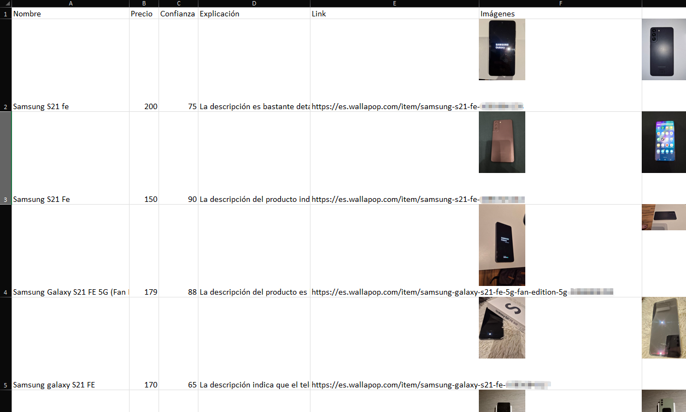

# Wallapop Scraper: for resellers
Hello!
This program uses Wallapop API for finding products that can be resold for a profit.
### How does this work?
1. Get the first page of products in the "Technology and electronics" category (this can be changed with `category_id`)
2. Get the keywords of each of the products found in the last step using Gemini 2.0 flash.
3. Search each of the keywords of each product on Wallapop.
4. Filters products to avoid outliers.
5. Get the cheapest products (the products on the first quarter of the pricing distribution of the products of the last step).
6. Makes a valoration of each of the products using the LLM by the photos, title and description.
7. Stores this info in an Excel under the folder `/out` like this:


### Usage:
1. Create a file called `.env` like this:
```
LLM_API_KEY = 'YOUR-GEMINI-API-KEY'
```
2. Install `requirements.txt`
```sh
pip install -r requirements.txt
```
3. Run 
```sh
python main.py
```